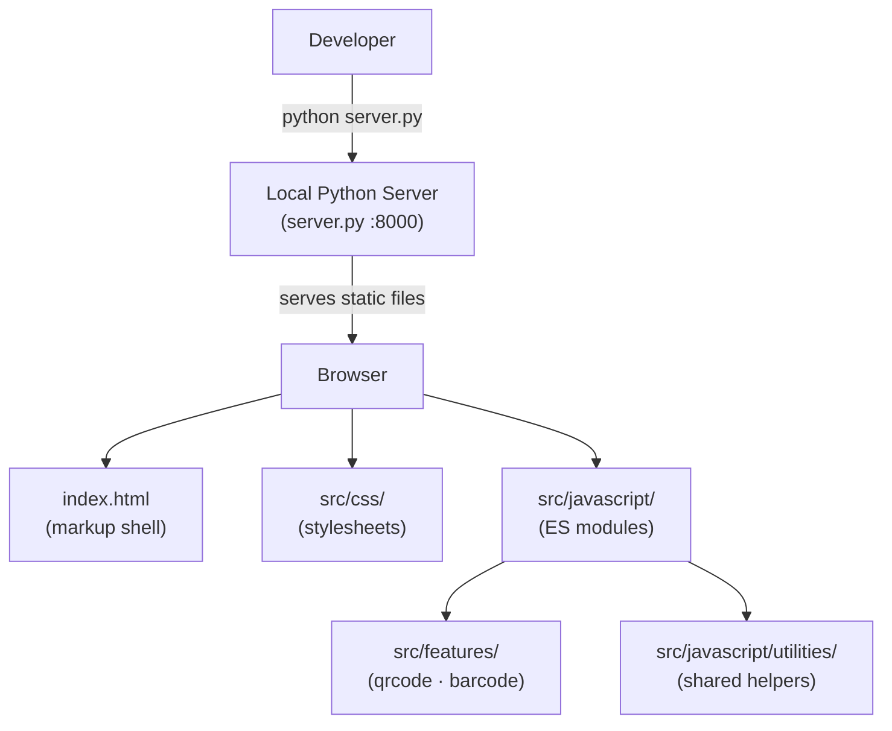
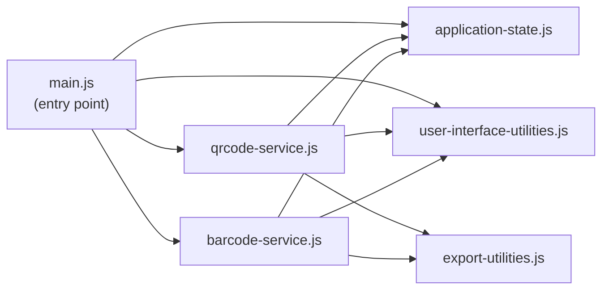
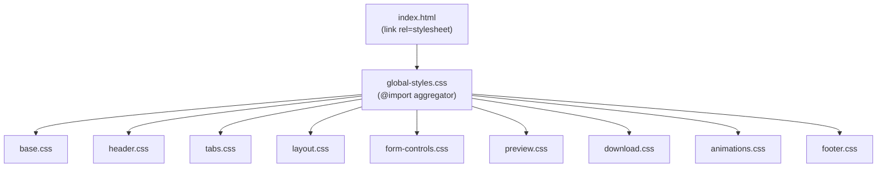
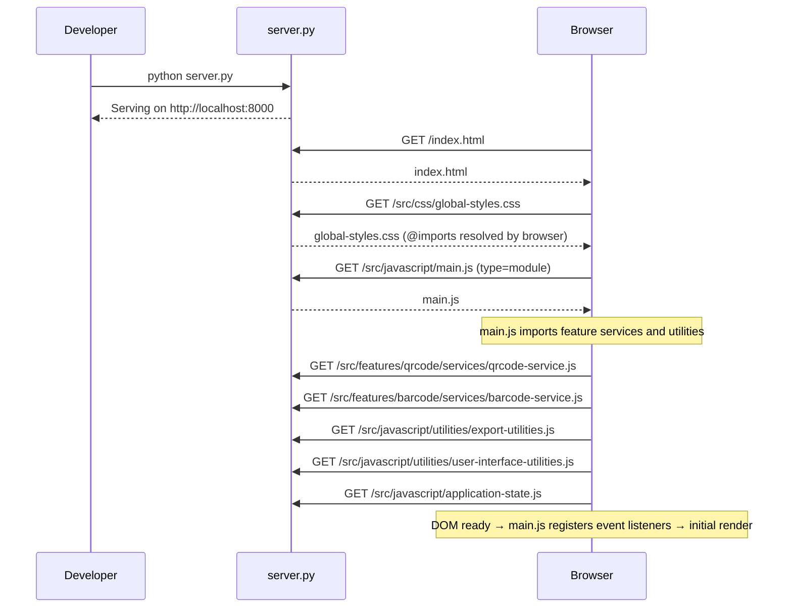

# Architecture Overview

This document describes the architecture of AIDC Studio, including the transition from a monolithic structure to a modular, feature-based architecture. The goal is to make the codebase easier to maintain, extend, and contribute to.

---

## Design Goals

The architecture of AIDC Studio follows several guiding principles:

| Goal | Description |
|---|---|
| **Modularity** | Components are separated into logical, single-responsibility modules. |
| **Maintainability** | Code should be easy to understand and modify. |
| **Reusability** | Common functionality is shared across features via utility modules. |
| **Scalability** | The structure supports future growth without reorganisation. |
| **Contributor Friendliness** | New contributors should quickly understand the codebase within three folder levels. |

---

## High-Level Architecture

The application is a purely static website. `server.py` is a lightweight development convenience — the browser loads all content directly as static files.



| Layer | Description |
|---|---|
| **Server layer** | Lightweight Python HTTP server for local development (`server.py`). |
| **Markup** | `index.html` — the application shell. Contains only structural HTML; no inline styles or scripts. |
| **Styles** | `src/css/` — modular CSS files, each focused on a single visual concern, aggregated by `global-styles.css`. |
| **JavaScript entry point** | `src/javascript/main.js` — loaded as `type="module"`. Registers all DOM event listeners and delegates to feature services. |
| **Application state** | `src/javascript/application-state.js` — single mutable state object shared across all modules. |
| **Shared utilities** | `src/javascript/utilities/` — helpers reused by both features (UI interactions, canvas export). |
| **Feature modules** | `src/features/` — self-contained domain logic for each AIDC format (QR Code, Barcode). |

---

## Module Dependency Graph



---

## File Structure

```
AIDC-Studio/
├── index.html                          # Application shell (markup only)
├── server.py                           # Lightweight local development server
├── README.md                           # Project overview and getting-started guide
├── ARCHITECTURE.md                     # This document
├── CONTRIBUTING.md                     # Contribution guidelines and naming conventions
└── src/
    ├── css/
    │   ├── global-styles.css           # Entry point — @imports all focused stylesheets below
    │   ├── base.css                    # CSS custom properties, universal reset, body effects
    │   ├── header.css                  # Application header and logo
    │   ├── tabs.css                    # Tab navigation bar and tab panels
    │   ├── layout.css                  # Workspace grid, cards, field labels, two-column grid
    │   ├── form-controls.css           # Inputs, colour pickers, dropdowns, style chips, EC buttons
    │   ├── preview.css                 # Sticky preview column, QR Code and Barcode preview cards
    │   ├── download.css                # Download card, format toggle buttons, download action button
    │   ├── animations.css              # Keyframe definitions and animation utility classes
    │   └── footer.css                  # Site footer
    ├── javascript/
    │   ├── application-state.js        # Single mutable state object (shared across all modules)
    │   ├── main.js                     # Entry point — registers all DOM event listeners
    │   └── utilities/
    │       ├── user-interface-utilities.js   # Dropdown, tab switching, colour sync, button-state helpers
    │       └── export-utilities.js           # Shared title rendering, canvas helpers, and file export
    └── features/
        ├── qrcode/
        │   └── services/
        │       └── qrcode-service.js   # Quick Response Code generation, preview, and download
        └── barcode/
            └── services/
                └── barcode-service.js  # Barcode generation, validation, preview, and download
```

---

## CSS Architecture

All styles are imported through a single entry point. Import order is significant — design tokens (`base.css`) must load before any component that consumes them.



Each stylesheet focuses on **a single visual concern**, making it straightforward to locate and modify any given style without side effects.

---

## Page Rendering Flow



---

## Feature Module Responsibilities

### `qrcode-service.js`

Owns all Quick Response Code business logic:
- Reads state from `application-state.js`
- Calls the `QRCode` CDN library to generate the code
- Renders the live title preview via shared `export-utilities.js`
- Handles PNG / JPEG / WebP / BMP / SVG / PDF download

### `barcode-service.js`

Owns all Barcode business logic:
- Validates the input value against the selected format
- Calls the `JsBarcode` CDN library to render the SVG
- Renders the live title preview via shared `export-utilities.js`
- Handles PNG / JPEG / WebP / BMP / SVG / PDF download

### `export-utilities.js`

Shared canvas and export helpers consumed by **both** feature modules:
- `applyTitleTextStyles` — applies font, size, weight, alignment to the title element
- `buildTitleSvgMarkup` — serialises the title element as an inline SVG string
- `buildRasterizedCanvas` — composites title + code onto an `HTMLCanvasElement`
- `exportCanvasAsFile` / `triggerBlobDownload` — drives the file-save flow

### `user-interface-utilities.js`

Shared UI interaction helpers:
- Custom dropdown widget (including body-teleport for stacking-context escape)
- Tab switching
- Colour picker ↔ hex input synchronisation
- Button-group active-state management

---

## Future Improvements

Potential improvements to consider as the project grows:

- **Component extraction** — move repeated HTML fragments (e.g. colour-picker rows, typography cards) into reusable HTML template partials or Web Components
- **Automated testing** — add unit tests for pure utility functions in `export-utilities.js`
- **Static site generation** — pre-render the HTML shell with a lightweight tool to improve cold-start performance
- **Asset bundling** — introduce a zero-config bundler (e.g. Vite) if the CDN dependency list grows significantly
- **Continuous integration** — add a GitHub Actions workflow to validate JavaScript syntax and CSS lint on every pull request

---

## Summary

The modular architecture improves AIDC Studio by:

- **Separating concerns** — markup, styles, and logic each live in dedicated files
- **Eliminating duplication** — shared canvas and export logic lives in one place (`export-utilities.js`)
- **Improving maintainability** — each file has a single, clear responsibility
- **Enabling easier contributions** — any piece of functionality can be found within three folder levels
- **Preparing for long-term growth** — the feature-based layout accommodates new AIDC formats without restructuring
